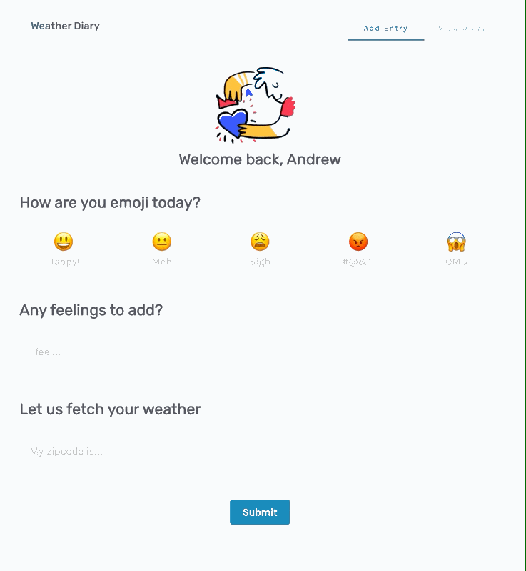

# Weather Journal
A web app that allows you to log your mood and thoughts, while it automatically fetches the temperature of the day

### Features
- Select an emotion you're feeling, write down your thoughts
- The day's temperature is automatically captured
- Display a list of your previously recorded thoughts and emotions

### Demo

### Created by
Andrew Chen, for Udacity Front End Development Nanodegree, Assignment 2